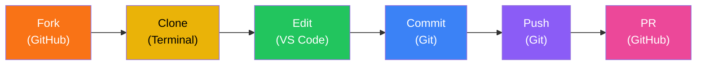

<style>
:root {
  --slidev-theme-primary: #212e7e;
  --slidev-theme-accent: #8893D3;
}
.slidev-layout {
  --color-primary: #212e7e;
}
a {
  color: #212e7e;
}
h1, h2, h3 {
  color: #212e7e !important;
}
.slidev-layout.section h1,
.slidev-layout.section h2 {
  color: #212e7e !important;
}
section.slidev-layout.section {
  background: #212e7e;
}
.slidev-layout.section p {
  color: #8893D3;
}
.slidev-layout.center h1 {
  color: #212e7e !important;
}
blockquote {
  border-left-color: #8893D3;
}
code {
  color: #212e7e;
}
</style>

<div class="flex flex-col items-center">
  

  <h1 class="!text-4xl">Your First Open-Source Contribution</h1>

  <p class="text-lg opacity-80">Anas Najaa - ktech</p>
  <p>Using <strong>VS Code</strong>, the <strong>Terminal</strong>, and <strong>GitHub Copilot</strong> to Contribute to a Real Project</p>
</div>

<div class="abs-br m-6 flex gap-2">
  <a href="https://github.com/Kuwait-Technical-College/cybersecurity_zen_koans_app" target="_blank" class="text-xl slidev-icon-btn">
    <carbon-logo-github />
  </a>
</div>

---
transition: fade-out
---

# Lesson Overview

<br>

| | |
|---|---|
| **Duration** | 2 – 2.5 hours |
| **Audience** | Complete beginners — no prior experience required |
| **OS** | Windows (with macOS notes) |
| **End Goal** | Add a cybersecurity zen koan & submit a Pull Request |
| **Repository** | [cybersecurity_zen_koans_app](https://github.com/Kuwait-Technical-College/cybersecurity_zen_koans_app) |

---

# What You Will Learn

<v-clicks>

- 🖥️ How to use **VS Code** (editor, terminal, extensions)
- ⌨️ Basic **terminal / command-line** commands
- 🔀 **Git** fundamentals (clone, add, commit, push)
- 🌐 **GitHub** workflow (fork, pull request)
- 🤖 Using **AI (GitHub Copilot)** to assist development

</v-clicks>

---

# The App: Cybersecurity Zen Koans

<v-clicks>

- 📱 A **real mobile app** built with Flutter — available on the **App Store** and **Google Play Store**
- 🧘 Displays short, zen-style cybersecurity sayings with technical explanations
- 📄 All koans live in a single file: `src/assets/koans.json`
- 🌍 **Anyone** can contribute new koans via a Pull Request

</v-clicks>

<br>

<v-click>

> Once your PR is approved and merged, a **new version of the app** will be published to both stores — **with your koan inside it**. Your words, in the hands of real users worldwide.

</v-click>

---

# What is Open Source?

<v-clicks>

- 🔓 Source code is **publicly available** — anyone can view, use, modify, and share it
- 🌍 Built in the open — not locked inside one company
- 💻 **Linux**, **Android**, **Firefox**, **VS Code**, **Python** — all open source

</v-clicks>

<br>

<v-click>

> Think of it like a community recipe book. Anyone can read the recipes, improve them, or add new ones. The more people contribute, the better it gets.

</v-click>

---

# Why Should We Care?

<v-clicks>

- 📚 **Learning** — Read real-world code from experienced developers
- 💼 **Career** — Contributions are visible on your GitHub profile; employers notice
- 🤝 **Community** — Collaborate with developers worldwide from your laptop
- 💰 **Freedom** — Free tools, no expensive licenses
- 🛡️ **Quality** — Thousands of eyes catch bugs faster = more reliable & secure software

</v-clicks>

---

# Open Source and the Internet

The internet **would not exist** without open source.

| Layer | Open-Source Examples |
|---|---|
| Operating systems | Linux powers ~96% of top web servers |
| Web servers | Nginx, Apache |
| Languages | Python, JavaScript, PHP, Go, Rust |
| Databases | MySQL, PostgreSQL, MongoDB |
| Frameworks | React, Django, Flutter, Express |
| Infrastructure | Docker, Kubernetes, Terraform |
| Version control | Git itself (created by Linus Torvalds) |

<v-click>

> Every website you visit — Google, YouTube, your bank — runs on open-source software.

</v-click>

---

# AI and Open Source

<v-clicks>

- 🧠 **AI frameworks are open source**: TensorFlow, PyTorch, Hugging Face
- 🤖 **Open models**: LLaMA, Mistral, Stable Diffusion — free to use and study
- ✨ **GitHub Copilot** was trained on open-source code — without it, AI coding assistants wouldn't exist
- 🔄 **AI helps open source back**: Copilot helps beginners contribute (exactly what we're doing today!)

</v-clicks>

<br>

<v-click>

> Open code trains better AI. Better AI helps more people write open code. They fuel each other.

</v-click>

---

# How It All Connects to Cybersecurity

<v-clicks>

- 🛠️ **Security tools are open source**: Wireshark, Metasploit, Nmap, OWASP ZAP
- 🔍 **Transparency = trust**: Open code means no hidden backdoors
- ⚡ **Faster fixes**: Log4Shell (2021) was patched in days because Log4j was open source
- 🧠 **AI + security**: Threat detection, malware analysis — built on open-source AI frameworks
- 📱 **Today's app**: You're spreading cybersecurity awareness through a real, public app

</v-clicks>

<br>

<v-click>

> Open source, the internet, AI, and cybersecurity are all deeply connected. By contributing today, you're stepping into the ecosystem that powers modern technology.

</v-click>

---
layout: section
---

# Phase 0
## Pre-Class Setup

⏱ ~15 minutes

---

# 0.1 — Install Visual Studio Code

<v-clicks>

1. Go to **https://code.visualstudio.com/**
2. Click **Download for Windows**
3. Run the installer with default settings
4. ✅ Check **"Add to PATH"** on the Additional Tasks screen

</v-clicks>

<br>

<v-click>

> This lets you open VS Code from the terminal later

</v-click>

---

# 0.2 — Install Git for Windows

<v-clicks>

1. Go to **https://git-scm.com/download/win**
2. Download and run the installer
3. Accept all default settings
4. Installs `git` + **Git Bash** (a Linux-like terminal on Windows)

</v-clicks>

---

# 0.3 — Create a GitHub Account

<v-clicks>

1. Go to **https://github.com/join**
2. Sign up with a personal email
3. Verify your email
4. **Remember your username and password!**
5. Follow the college: **[Kuwait-Technical-College](https://github.com/Kuwait-Technical-College)** → click **Follow**

</v-clicks>

---

# 0.4 — Install GitHub Copilot Extension

<v-clicks>

1. Open VS Code
2. Press **Ctrl+Shift+X** → Extensions sidebar
3. Search for **"GitHub Copilot"**
4. Click **Install**
5. "GitHub Copilot Chat" installs automatically
6. **Sign in to GitHub** when prompted

</v-clicks>

<br>

<v-click>

> **Fallback**: Can't activate Copilot? Use [Gemini free](https://gemini.google.com) in a browser tab as an alternative.

</v-click>

---

# ✅ Setup Checklist

<v-clicks>

- [ ] VS Code installed and opens correctly
- [ ] Git installed (`git --version` shows a version number)
- [ ] GitHub account created and email verified
- [ ] GitHub Copilot extension installed and signed in

</v-clicks>

---
layout: section
---

# Phase 1
## Orientation: VS Code and the Terminal

⏱ ~20 minutes

---

# 1.1 — Tour of VS Code

Key areas to know:

| Area | Shortcut | What It Does |
|---|---|---|
| **File Explorer** | `Ctrl+Shift+E` | Browse files and folders |
| **Search** | `Ctrl+Shift+F` | Search across all files |
| **Source Control** | `Ctrl+Shift+G` | Visual Git interface |
| **Extensions** | `Ctrl+Shift+X` | Install add-ons |
| **Terminal** | `` Ctrl+` `` | Built-in command line |
| **Command Palette** | `Ctrl+Shift+P` | Search any action |

---

# 1.2 — What is a Terminal?

<br>

<v-click>

> Think of it as a **text-based version of File Explorer**. Instead of clicking to open folders, you **type commands**.

</v-click>

<br>

<v-click>

Open it with `` Ctrl+` `` (backtick key, above Tab)

</v-click>

<br>

<v-click>

Developers use the terminal because it's **faster and more powerful** — many tools like Git are designed for it.

</v-click>

---

# 1.3 — Essential Terminal Commands

| Command (Windows) | Command (macOS/Linux) | What It Does |
|---|---|---|
| `cd` | `pwd` | Shows current directory |
| `dir` | `ls` | Lists files and folders |
| `cd Desktop` | `cd Desktop` | Move into Desktop |
| `cd ..` | `cd ..` | Move up one level |
| `mkdir my-folder` | `mkdir my-folder` | Create a new folder |
| `cls` | `clear` | Clear the screen |

<br>

<v-click>

> **Key concept**: You are always "inside" a folder — your **working directory**.

</v-click>

---

# 1.4 — Practice Exercise

```bash
cd Desktop
mkdir projects
cd projects
dir
```

<br>

<v-click>

You should now be inside an empty `projects` folder on your Desktop.

</v-click>

<v-click>

> 🧑‍🏫 **Checkpoint**: You should see `Desktop\projects` as your current location.

</v-click>

---
layout: section
---

# Phase 2
## Git and GitHub: Fork and Clone

⏱ ~25 minutes

---

# 2.1 — Key Concepts

| Concept | Analogy |
|---|---|
| **Git** | "Track Changes" in Word, but for code |
| **GitHub** | Google Drive, but for code |
| **Repository** | A project folder tracked by Git |
| **Fork** | Your own copy of someone else's project |
| **Clone** | Downloading your fork to your computer |
| **Commit** | Saving a snapshot of your changes |
| **Push** | Uploading commits to GitHub |
| **Pull Request** | Asking the owner to accept your changes |

---

# The Full Workflow

<br>


---

# 2.2 — Fork the Repository

<v-clicks>

1. Open **https://github.com/Kuwait-Technical-College/cybersecurity_zen_koans_app**
2. Click the **Fork** button (top-right)
3. Keep all defaults → Click **Create fork**

</v-clicks>

<br>

<v-click>

You now have your own copy at:

`https://github.com/YOUR-USERNAME/cybersecurity_zen_koans_app`

</v-click>

<v-click>

> "Nothing you do here affects the original until you submit a Pull Request."

</v-click>

---

# 2.3 — Clone to Your Computer

<v-clicks>

1. On your fork → Click green **Code** button
2. Ensure **HTTPS** is selected → Copy the URL
3. In VS Code terminal:

</v-clicks>

<br>

```bash
git clone https://github.com/YOUR-USERNAME/cybersecurity_zen_koans_app.git
cd cybersecurity_zen_koans_app
code .
```

<v-click>

> **Troubleshooting**: If `code .` doesn't work → **File → Open Folder**

</v-click>

---

# 2.4 — Configure Git Identity

One-time setup — Git needs to know who you are:

```bash
git config --global user.name "Your Name"
git config --global user.email "your-email@example.com"
```

<br>

<v-click>

Use the **same email** you used for GitHub.

</v-click>

---

# 2.5 — Explore the Project

Navigate to: `src → assets → koans.json`

<br>

**217 cybersecurity zen koans** — short, thought-provoking sayings:

```json
{
  "koanText": "The strongest firewall is useless against a user who clicks 'Allow'.",
  "technicalExplanation": "This koan highlights the critical importance of user behavior...",
  "uniqueCode": "7H93FT"
}
```

| Field | Description |
|---|---|
| `koanText` | A short, wise cybersecurity saying |
| `technicalExplanation` | Detailed explanation of the concept |
| `uniqueCode` | Unique 6-character identifier |

---
layout: section
---

# Phase 3
## Using Copilot to Create a New Koan

⏱ ~25 minutes

---

# 3.1 — Open Copilot Chat

<v-clicks>

1. Press **Ctrl+Shift+I** to open Copilot Chat
2. A chat panel opens — this is your AI assistant

</v-clicks>

<br>

<v-click>

> **What is GitHub Copilot?** A free AI assistant built into VS Code. Think of it as a knowledgeable coding partner you can chat with.

</v-click>

---

# 3.2 — Generate a Koan

Make sure `koans.json` is open, then ask Copilot:

<br>

> *"Generate a new cybersecurity zen koan in JSON format matching the structure in my open koans.json file. The koan should be about **phishing**. Include: koanText, technicalExplanation, and a unique 6-character alphanumeric uniqueCode."*

<br>

<v-click>

**Pick your own topic!**

<div class="grid grid-cols-4 gap-2 mt-2">
  <div class="p-2 bg-blue-500/10 rounded text-center">Phishing</div>
  <div class="p-2 bg-green-500/10 rounded text-center">Ransomware</div>
  <div class="p-2 bg-yellow-500/10 rounded text-center">2FA</div>
  <div class="p-2 bg-red-500/10 rounded text-center">Social Engineering</div>
  <div class="p-2 bg-purple-500/10 rounded text-center">Passwords</div>
  <div class="p-2 bg-pink-500/10 rounded text-center">Wi-Fi Security</div>
  <div class="p-2 bg-orange-500/10 rounded text-center">Updates</div>
  <div class="p-2 bg-teal-500/10 rounded text-center">Data Privacy</div>
</div>

</v-click>

---

# 3.3 — Review and Iterate

Ask yourself:

<v-clicks>

- Does the `koanText` sound **wise and thought-provoking**?
- Is the `technicalExplanation` **accurate**?
- Does it match the **style** of existing koans?

</v-clicks>

<br>

<v-click>

Refine with follow-up prompts:

- *"Make the koan shorter and more poetic"*
- *"Make the explanation more detailed"*
- *"Give me a different koan about the same topic"*

</v-click>

<br>

<v-click>

> 🧠 "AI is a tool, not a replacement for your brain. Always review what it generates."

</v-click>

---

# 3.4 — Add the Koan to koans.json

<v-clicks>

1. **Ctrl+End** to jump to the bottom
2. After the last `}`, before the `]`, add a comma
3. Paste your new koan

</v-clicks>

<br>

```json {all|4-8}
    "uniqueCode": "Q1PFVW"
  },
  {
    "koanText": "Your new koan text here",
    "technicalExplanation": "Your explanation here",
    "uniqueCode": "YOUR6C"
  }
]
```

<v-click>

> ⚠️ Watch for: missing comma, extra trailing comma, wrong field names. Red squiggly = fix it!

</v-click>

---

# 3.5 — Verify Your uniqueCode

Check that your code doesn't already exist:

**Windows:**
```bash
findstr "YOUR6C" src\assets\koans.json
```

**macOS / Git Bash:**
```bash
grep "YOUR6C" src/assets/koans.json
```

<v-click>

- **No output** → ✅ Code is unique
- **A line appears** → ❌ Generate a different code

</v-click>

<br>

<v-click>

**Bonus** — count total koans:
```bash
grep -c "uniqueCode" src/assets/koans.json
# Should print 218 after adding yours
```

</v-click>

---
layout: section
---

# Phase 4
## Commit, Push, and Pull Request

⏱ ~25 minutes

---

# 4.1 — Check What Changed

```bash
git status
```

<v-click>

```
modified:   src/assets/koans.json
```

</v-click>

<br>

<v-click>

See the exact changes:

```bash
git diff src/assets/koans.json
```

- Lines in **green** (`+`) = added
- Lines in **red** (`-`) = removed

</v-click>

<v-click>

> 💡 **Visual alternative**: `Ctrl+Shift+G` → Source Control → click the file for a side-by-side diff

</v-click>

---

# 4.2 — Stage Your Changes

```bash
git add src/assets/koans.json
```

<br>

<v-click>

> **What is staging?** Like putting items in a box before shipping. You choose exactly which changes go into this commit.

</v-click>

---

# 4.3 — Commit Your Changes

```bash
git commit -m "Add new cybersecurity koan about phishing"
```

<br>

<v-click>

> **What is a commit?** A save point in a video game. It records the exact state of your files. The `-m` flag adds a description message.

</v-click>

---

# 4.4 — Push to GitHub

```bash
git push origin main
```

<br>

<v-clicks>

- `origin` = your GitHub fork (where you cloned from)
- `main` = the branch name

</v-clicks>

<br>

<v-click>

> **Authentication**: Windows may open a browser to sign in. If you get errors, you may need a [Personal Access Token](https://github.com/settings/tokens).

</v-click>

---

# 4.5 — Verify on GitHub

<v-clicks>

1. Open your fork: `github.com/YOUR-USERNAME/cybersecurity_zen_koans_app`
2. See your commit at the top
3. Click `src/assets/koans.json` → scroll to bottom → see your koan

</v-clicks>

---

# 4.6 — Create a Pull Request

<v-clicks>

1. On your fork, see: *"This branch is 1 commit ahead"*
2. Click **Contribute** → **Open pull request**
3. **Title**: `Add new koan: [brief description]`
4. **Description**: 1–2 sentences about your koan topic
5. Click **Create pull request**

</v-clicks>

---
layout: center
class: text-center
---

# 🎉 Congratulations!

<br>

<v-clicks>

✅ Used a professional code editor (**VS Code**)

✅ Navigated the **terminal** like a developer

✅ Used **AI** (GitHub Copilot) to create content

✅ Used **Git** to track and submit changes

✅ Contributed to a **real open-source project**

</v-clicks>

<br>

<v-click>

Your Pull Request is now live on the [project's PR page](https://github.com/Kuwait-Technical-College/cybersecurity_zen_koans_app/pulls)! 🚀

</v-click>

<v-click>

> Once merged, a **new version of the app** ships to the **App Store** & **Play Store** — with your koan in it! 📱

</v-click>

---

# The Workflow You Learned

<br>



---

# Keep Learning

| Resource | Link |
|---|---|
| VS Code Docs | [code.visualstudio.com/docs](https://code.visualstudio.com/docs) |
| Git Basics (free book) | [git-scm.com/book](https://git-scm.com/book/en/v2/Getting-Started-About-Version-Control) |
| GitHub Skills | [skills.github.com](https://skills.github.com/) |
| GitHub Copilot Docs | [docs.github.com/copilot](https://docs.github.com/en/copilot) |

<br>

<v-click>

### Bonus Challenges

- Add **2 or more koans** in a single PR
- **Review** another student's Pull Request
- **Explore** the repo — how does `koans.json` get loaded?

</v-click>

---
layout: center
class: text-center
---

<div class="flex flex-col items-center">
  

  <h1 class="!text-4xl">Thank You</h1>

  <p><strong>Kuwait Technical College (ktech)</strong></p>
  <br>
  <p>Happy contributing! 🎉</p>
</div>
